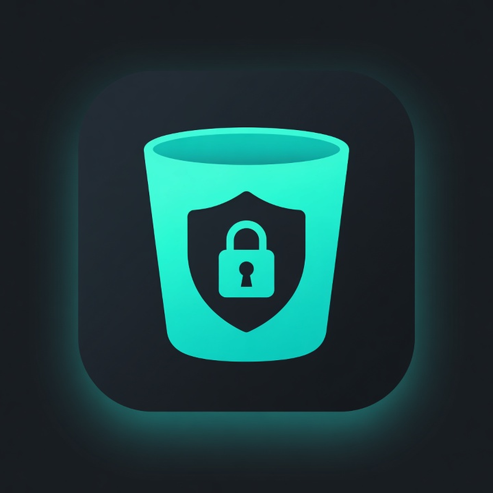

# CryptoMako for iOS / iPadOS

<p align="center">
  
</p>


[](LICENSE)
[](https://github.com/guillebot/cryptomako-ios)
[](https://swift.org)

**Point CryptoMako at any S3-compatible bucket over HTTPS, unlock a [Cryptomator](https://cryptomator.org) format-8 vault, browse / open / write plaintext files on iPhone and iPad, share into the vault, and back up on-device folders.**

Sibling of the macOS app **[guillebot/cryptomako](https://github.com/guillebot/cryptomako)**. Same vault format, same SigV4 object store, AGPLv3. Ciphertext stays on the object store; decryption is in-process. Secrets live in the **Keychain** only.

## Status

| Milestone | Scope |
|-----------|--------|
| **M0** | Shared cores: `CryptoMakoS3`, `CryptoMakoShared`, `CryptoMakoVault` |
| **M1** | Unlock + browse + download/open; connection UI; HTTPS/ATS only |
| **M2** | Light writes (create folder / upload / delete) — fail-closed against remote |
| **M3** | Files provider (Files app location) + Share extension → inbox → vault |
| **M4** | On-device folder backup into `Backups/…` with excludes |

See [docs/ios-milestones.md](docs/ios-milestones.md) and [docs/asc-checklist.md](docs/asc-checklist.md) (TestFlight / ASC).

**Version:** 1.0.0 (product-complete for TestFlight / App Store Connect upload in a later pass).

## Open in Xcode

```bash
cd ~/dev/cryptomako-ios
# optional: refresh golden fixtures from the macOS sibling
cp -R ../cryptomako/fixtures/PASSWORD ../cryptomako/fixtures/vault fixtures/
xcodegen generate   # needs brew install xcodegen
open CryptoMako.xcodeproj
```

- **Bundle ID:** `net.gschimmel.cryptomako.ios`
- **File Provider:** `net.gschimmel.cryptomako.ios.FileProvider`
- **Share:** `net.gschimmel.cryptomako.ios.Share`
- **App Group:** `group.net.gschimmel.cryptomako.ios`
- **Team ID:** `H4K6YW7MQM`
- Select an iOS 17+ Simulator or device, then Run.

### Local fixture unlock (Simulator)

1. Choose **Local fixtures**.
2. Vault path: absolute path of `fixtures/vault`, e.g. `/Users/guille/dev/cryptomako-ios/fixtures/vault`
3. Password: contents of `fixtures/PASSWORD` (copy from the macOS repo).
4. Unlock → browse; **New folder / Upload / Delete** mutate the local DirectoryObjectStore tree (fail-closed after put/delete).

### S3 unlock + Files

Endpoint must be `https://…` (ATS). After unlock, a **CryptoMako** location is registered for the Files app (device / proper provisioning). Writes and Files provider commits are fail-closed: UI success only after remote put/delete.

### Share into vault

Share sheet → **CryptoMako** stages files into the App Group inbox. With the app unlocked (or on next foreground), they import into the **current** vault directory.

### Backup folder

Browse → **Backup folder into vault…** → pick a folder. Files are encrypted under `Backups/<folderName>/…` with the same excludes as macOS (`BackupSyncExcludes`: `.DS_Store`, `node_modules`, etc.).

## Build libraries / tests

```bash
cd ~/dev/cryptomako-ios
swift test
xcodegen generate
xcodebuild -project CryptoMako.xcodeproj -scheme CryptoMako \
  -destination 'platform=iOS Simulator,name=iPhone 16' -configuration Debug build
```

## Device run

1. Register App Group `group.net.gschimmel.cryptomako.ios` and bundle IDs on the Apple Developer team `H4K6YW7MQM` (or let Xcode manage automatically).
2. Plug in iPhone/iPad → select your Team → Run.
3. Unlock against HTTPS S3; confirm Files → Browse → CryptoMako.

## License

**AGPL-3.0** — same as [guillebot/cryptomako](https://github.com/guillebot/cryptomako). Including paid distribution.
